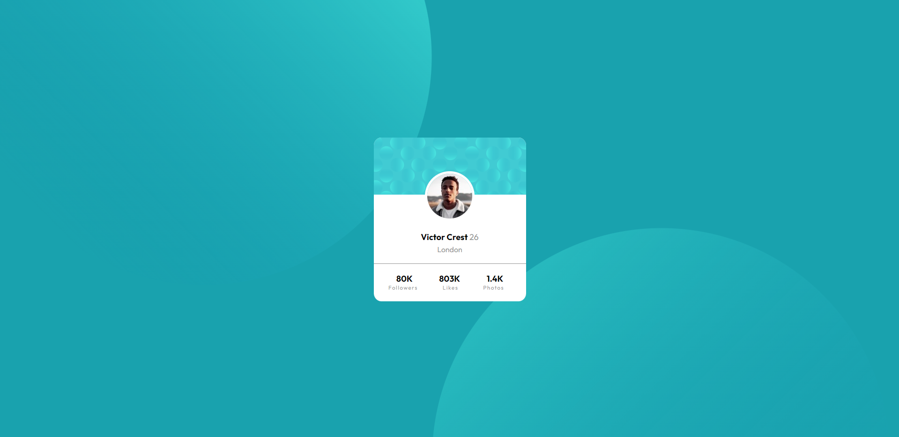

# Frontend Mentor - Profile card component solution

This is a solution to the [Profile card component challenge on Frontend Mentor](https://www.frontendmentor.io/challenges/profile-card-component-cfArpWshJ). Frontend Mentor challenges help you improve your coding skills by building realistic projects. 

## Table of contents

- [Overview](#overview)
  - [The challenge](#the-challenge)
  - [Screenshot](#screenshot)
  - [Links](#links)
- [My process](#my-process)
  - [Built with](#built-with)
  - [What I learned](#what-i-learned)
  - [Continued development](#continued-development)
  - [Useful resources](#useful-resources)
- [Author](#author)
- [Acknowledgments](#acknowledgments)

**Note: Delete this note and update the table of contents based on what sections you keep.**

## Overview

### The challenge

- Build out the project to the designs provided

### Screenshot

### Links

- Solution URL: [https://www.frontendmentor.io/solutions/flexbox-pseudoclass-selectors-bNXrDSc1Dh]
- Live Site URL: [https://lucianioan31.github.io/profile-card-component/]

## My process

### Built with

- Semantic HTML5 markup
- UL lists 
- used some center stuffs from the feedback I got on my last solution (https://www.frontendmentor.io/solutions/crazy-grid-qr-code-creation-fE_97-JdYg#feedback)
- still had problems with centering the card (I had to gave my flex container a height of 100vh)
- Flexbox
- pseudo-class selectors

### What I learned

A thing that was an "aha" for me is when I added the width for my flex container. I was struggling with the centering. 
Became more confident in using selectors. 

### Continued development

I had some major problems with positioning the backgrounds. Tried several ways, by using background-image and by using the img tag in HTML file. I have positioned them somehow but I don't like that whenever I change the vieport of the window, the background is changing too. 

### Useful resources

- [Example resource 1]((https://www.frontendmentor.io/solutions/crazy-grid-qr-code-creation-fE_97-JdYg#feedback)) - This helped me when I wanted to center the flex items. 

## Author
- Frontend Mentor - [@LucianIoan31](https://www.frontendmentor.io/profile/LucianIoan31)
- Github - [@LucianIoan31](https://github.com/LucianIoan31)

## Acknowledgments

Google everything you don't understand. Make use of available tools we have (sometimes I use ChatGPT for understanding things.)

